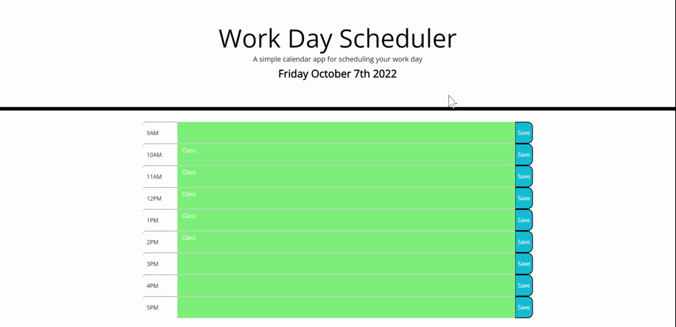

# daily-schedule-calendar

## Summary
 Daily Work scheduler that can be change based on the user's daily life. The color of each text-area will change based on past, present, and future.

## Technology Used
 - HTML : Use to stucture our website
 - CSS : Bootstrap and other property are used to make the text-area
 - JS  : Web api like jquery and moment.js was used to keep track of time and to traverse the the HTML
 - Git : for version control system to track changes to source code
 - GitHub : hosts the repository that can be deployed to GitHub Pages

## Site Picture


## Deployed Link
https://chanjeff520.github.io/daily-schedule-calendar/

## Instructions
<ol>
<li>Click on the textarea</li>
<li>When the area changes color, you can write in the area</li>
<li>Click the save button to save the inputed text</li>
</ol>


## Code Snippet
```js

function changeColorBlock(){
    var milHours = moment().format('HH');
    var hour = parseInt(milHours)- 9;
    
    //for pass color
    //0<=hour<15     0 is 9am  and  15 is 12am
    if(hour >= 0 && hour < 15)
    for(var i = 0; i<hour; i++){
        if(i<9){
            $(".container").children().eq(i).children().eq(1).addClass('past');
        }
    }

    //for current color
    //0<=hour<9      9 is 5pm
    if(hour >= 0 && hour < 9){
        $(".container").children().eq(hour).children().eq(1).addClass('present');
    }

    //for future color
    //hour<9
    if(hour < 0){
        for(var i =0; i< 9; i++){
            $(".container").children().eq(i).children().eq(1).addClass('future');
        }
    }else if(hour < 9){
        for(var i = hour + 1; i < 13 ; i++){
            $(".container").children().eq(i).children().eq(1).addClass('future');
        }
    }
}


```
This function above changes the color of each time-block depending on the time(past, present, future).

## Author Links
- [LinkedIn](https://www.linkedin.com/in/jefflchan/)
- [GitHub](https://github.com/chanjeff520)
